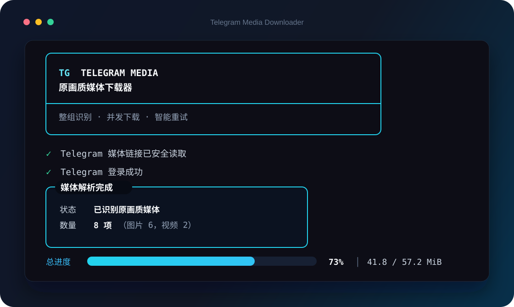

<p align="center">
  <strong>简体中文</strong> · <a href="README_EN.md">English</a>
</p>

<div align="center">
  
  <h1>Telegram Media Downloader</h1>
  <p><strong>把一条 Telegram 链接，变成整组原画质媒体文件。</strong></p>
  <p>相册、视频、评论区媒体一键保存；并发下载、智能重试、完整性校验全部内置。</p>

  <p>
    <a href="https://github.com/swttttt/telegram-media-downloader/actions/workflows/ci.yml"></a>
    
    
    
  </p>
</div>

<br>

<div align="center">
  
</div>

## 为什么选择它

<table>
  <tr>
    <td width="50%">
      <h3>🖼️ 整组原画质</h3>
      <p>自动识别同一帖子的完整相册，直接下载 Telegram 可提供的最高质量图片与视频，不截图、不二次压缩。</p>
    </td>
    <td width="50%">
      <h3>⚡ 又快又稳</h3>
      <p>默认 3 路并发、指数退避重试、限流等待、过期文件引用刷新，并使用 <code>cryptg</code> 加速解密。</p>
    </td>
  </tr>
  <tr>
    <td width="50%">
      <h3>💬 评论区也支持</h3>
      <p>可解析带 <code>?comment=</code> 的频道讨论链接，自动定位关联讨论组和评论相册。</p>
    </td>
    <td width="50%">
      <h3>🔐 凭据安全</h3>
      <p>API 凭据保存在 Windows 凭据管理器；登录会话、下载目录和临时文件默认不会进入 Git。</p>
    </td>
  </tr>
</table>

## 三步开始

### 1. 获取代码

```powershell
git clone https://github.com/swttttt/telegram-media-downloader.git
cd telegram-media-downloader
```

### 2. 安装依赖

```powershell
python -m pip install -r requirements.txt
```

### 3. 启动

双击 `start.bat`，或在 PowerShell 中运行：

```powershell
python telegram_media_downloader.py
```

随后粘贴 Telegram 帖子链接即可。下载结果默认保存在程序同目录的 `download` 文件夹。

`start.bat` 启动时可选择中文或 English。也可以直接启动英文界面：

```powershell
python telegram_media_downloader.py --lang en
```

如需永久使用英文，可设置环境变量 `TMD_LANG=en`。

> 首次运行需要输入自己的 `API_ID` 和 `API_HASH`。请前往 [my.telegram.org](https://my.telegram.org) → **API development tools** 创建；输入一次后会安全保存。

## 支持的链接

```text
# 公开频道帖子 / 相册
https://t.me/ExampleChannel/37

# Telegram 的 single 形式
https://t.me/ExampleChannel/37?single

# 频道帖子评论区中的媒体
https://t.me/channel/737?single&comment=7145

# 已加入的私有频道
https://t.me/c/1234567890/321
```

评论区文件会使用清晰且不冲突的名称：

```text
channel_737_comment_7145_01.jpg
channel_737_comment_7145_02.mp4
```

## 命令行用法

```powershell
# 直接下载指定帖子
python telegram_media_downloader.py "https://t.me/ExampleChannel/37?single"

# 指定保存目录
python telegram_media_downloader.py URL --output "E:\Telegram"

# 覆盖同名文件
python telegram_media_downloader.py URL --overwrite

# 自定义并发和重试
python telegram_media_downloader.py URL --jobs 4 --retries 6

# 删除安全保存的 API 凭据
python telegram_media_downloader.py --forget-credentials
```

| 参数 | 作用 | 默认值 |
| --- | --- | --- |
| `url` | Telegram 帖子、相册或评论链接 | 交互粘贴 |
| `-o, --output` | 媒体保存目录 | `./download` |
| `--overwrite` | 覆盖已存在的同名文件 | 关闭 |
| `-j, --jobs` | 并发下载数，范围 1–8 | `3` |
| `--retries` | 网络失败重试次数，范围 0–10 | `5` |
| `--forget-credentials` | 删除 Windows 凭据管理器中的 API 凭据 | — |
| `--lang` | 界面语言：`zh` 或 `en` | `zh` |

## 稳定性设计

- 下载先写入隐藏的 `.part` 临时文件，完整后再原子替换，避免留下伪装成成品的残缺文件。
- 可获取文件大小时进行严格校验；空文件或大小不一致会自动重试。
- 针对网络超时、Telegram 服务异常和 `file_reference` 过期自动恢复。
- 已存在的文件默认跳过，重复执行同一链接不会浪费流量。
- 遇到 Telegram 限流会按服务端要求等待，避免无效高频请求。
- 单个本地会话只允许一个程序实例使用，防止 SQLite 会话损坏。

## 项目结构

```text
telegram-media-downloader/
├─ assets/                       # README 品牌与界面预览
├─ telegram_media_downloader.py  # 主程序
├─ start.bat                     # Windows 一键启动
├─ README_EN.md                  # English documentation
├─ requirements.txt              # Python 依赖
├─ LICENSE                       # MIT License
└─ download/                     # 本地下载目录（不会提交）
```

## 常见问题

<details>
<summary><strong>为什么第一次要 API_ID / API_HASH？</strong></summary>
<br>
Telegram 用户客户端必须通过官方 API 身份连接。它们不是 Bot Token，也不是你的账号密码。本程序不会把凭据写入源码或明文配置文件。
</details>

<details>
<summary><strong>为什么提示“已有一个下载器窗口正在运行”？</strong></summary>
<br>
Telegram 登录会话由 SQLite 保存，同一会话不能被两个进程同时写入。关闭旧窗口或等待它完成后再运行即可。
</details>

<details>
<summary><strong>私有频道链接为什么无法下载？</strong></summary>
<br>
当前登录的 Telegram 账号必须已经加入该频道，并且拥有查看目标消息的权限。
</details>

<details>
<summary><strong>文件会被压缩吗？</strong></summary>
<br>
不会。本程序直接保存 Telegram API 返回的媒体文件，不做转码或二次压缩。
</details>

## 安全与使用范围

`telegram_media.session` 相当于本机登录会话，请勿分享；本项目已通过 `.gitignore` 排除它。请只下载你有权访问和保存的内容，并遵守 Telegram 服务条款及所在地法律。

## License

[MIT](LICENSE) © 2026 [swttttt](https://github.com/swttttt)
