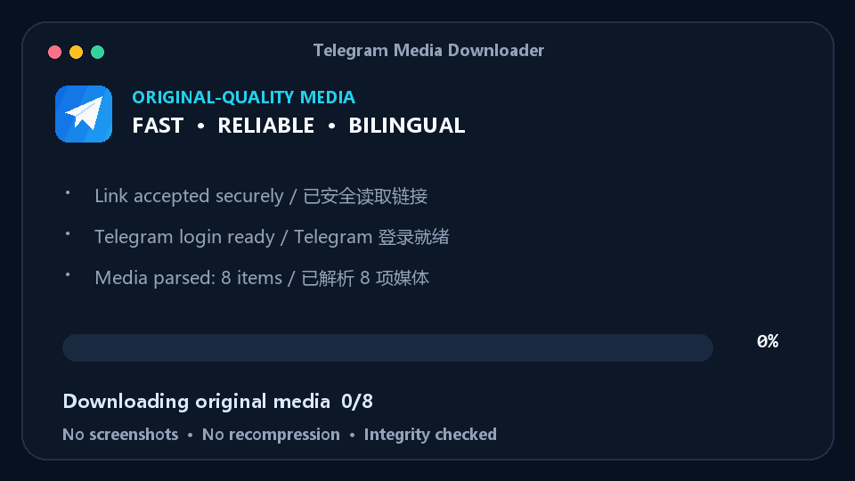

<p align="center">
  <a href="README.md">简体中文</a> · <strong>English</strong>
</p>

<div align="center">
  
  <h1>Telegram Media Downloader</h1>
  <p><strong>One link. Every original-quality Telegram image and video.</strong></p>
  <p>Download complete albums, individual videos, and discussion media with no config file, plus built-in parallel downloads, retries, and integrity checks.</p>

  <p>
    <a href="https://github.com/swttttt/telegram-media-downloader/releases/latest"></a>
    <a href="https://github.com/swttttt/telegram-media-downloader/actions/workflows/ci.yml"></a>
    <a href="https://github.com/swttttt/telegram-media-downloader/stargazers"></a>
    
  </p>
</div>

<div align="center">
  <a href="https://github.com/swttttt/telegram-media-downloader/releases/latest"><strong>⬇️ Download the latest portable Windows build</strong></a>
</div>

<br>

<div align="center">
  
</div>

> ⭐ If this project saves you time, consider starring it. Your support helps other people discover it.

## What it solves

Saving a Telegram album from the web client often means clicking every item, while media inside discussions can be hard to organize. This tool resolves one post URL into the complete media group and saves the files provided by Telegram’s API—without screenshots, transcoding, or recompression.

| Capability | This project | Browser save | Typical CLI script |
| --- | :---: | :---: | :---: |
| Complete album from one URL | ✅ | ❌ | Varies |
| Discussion `?comment=` media | ✅ | Manual | Rare |
| Original files provided by Telegram | ✅ | Inconsistent | Varies |
| Portable Windows executable | ✅ | — | Usually needs Python |
| Chinese and English UI | ✅ | — | Usually one language |
| Windows Credential Manager | ✅ | — | Often plain-text config |
| Parallelism, retries, integrity checks | ✅ | ❌ | Varies |

## Fastest start: portable Windows build

1. Open [Releases](https://github.com/swttttt/telegram-media-downloader/releases/latest) and download `TelegramMediaDownloader-v*-windows-x64.zip`.
2. Extract it, double-click `start.bat`, and select **English**.
3. Paste a Telegram post URL. Media is saved in the `download` folder beside the program.

You can also run `TelegramMediaDownloader.exe --lang en` from a terminal.

> The first run asks for your own `API_ID` and `API_HASH`. Create them under **API development tools** at [my.telegram.org](https://my.telegram.org). They are not your account password and are saved in Windows Credential Manager after the first entry.

## Supported URLs

```text
# Public channel post or album
https://t.me/ExampleChannel/37

# Telegram's single form
https://t.me/ExampleChannel/37?single

# Media inside a channel discussion
https://t.me/ExampleChannel/737?single&comment=7145

# A private channel the current account has joined
https://t.me/c/1234567890/321
```

The downloader detects the complete media group and generates collision-resistant names for its images and videos.

## Run from source

Requires Windows 10/11 and Python 3.10 or newer:

```powershell
git clone https://github.com/swttttt/telegram-media-downloader.git
cd telegram-media-downloader
python -m pip install -r requirements.txt
python telegram_media_downloader.py --lang en
```

You can also double-click `start.bat` in the source folder. It checks dependencies and lets you choose the interface language.

## Command-line usage

```powershell
# Download a post
python telegram_media_downloader.py "https://t.me/ExampleChannel/37?single" --lang en

# Choose a destination
python telegram_media_downloader.py URL --output "D:\Telegram" --lang en

# Replace existing same-name files
python telegram_media_downloader.py URL --overwrite --lang en

# Customize parallelism and retries
python telegram_media_downloader.py URL --jobs 4 --retries 6 --lang en

# Delete stored API credentials
python telegram_media_downloader.py --forget-credentials --lang en
```

| Option | Purpose | Default |
| --- | --- | --- |
| `url` | Telegram post, album, or discussion URL | Interactive prompt |
| `-o, --output` | Media destination | `download` beside the app |
| `--overwrite` | Replace existing same-name files | Off |
| `-j, --jobs` | Parallel downloads, from 1 to 8 | `3` |
| `--retries` | Retries after network failures, from 0 to 10 | `5` |
| `--forget-credentials` | Remove API credentials from Windows Credential Manager | — |
| `--lang` | Interface language: `zh` or `en` | `zh` |
| `--version` | Print the application version | — |

## Why it is fast and reliable

- `cryptg` accelerates Telegram media decryption, with several media items processed in parallel by default.
- Network timeouts, temporary Telegram failures, and expired `file_reference` values recover automatically.
- Telegram flood waits are respected instead of being retried aggressively.
- Downloads go to hidden `.part` files and are atomically moved into place only after size validation.
- Existing files are skipped by default, so running the same URL again does not waste bandwidth.
- A local session is protected against simultaneous writes that could corrupt its SQLite database.

## Privacy and security

- API credentials are kept in Windows Credential Manager, not source code or a plain-text config file.
- Telegram sessions, downloads, caches, and local build folders are excluded by `.gitignore`.
- Project screenshots and demo data are anonymous and contain no channel, group, account, post URL, or local path.
- A session file represents local authorization and must never be uploaded or shared. Only download content you have permission to access and save.

## FAQ

<details>
<summary><strong>Why are API_ID and API_HASH required?</strong></summary>
<br>
Telegram user clients must connect using an official API application identity. These values are not a Bot Token or your account password. A project author cannot safely distribute one public credential pair to every user.
</details>

<details>
<summary><strong>Are files compressed?</strong></summary>
<br>
No. The downloader saves media returned by the Telegram API without transcoding or recompression.
</details>

<details>
<summary><strong>Why does a private-channel URL fail?</strong></summary>
<br>
The currently signed-in Telegram account must already be a member of that channel and have permission to view the target message.
</details>

<details>
<summary><strong>Why does it say another downloader is running?</strong></summary>
<br>
The Telegram login session is stored in SQLite and cannot be written by two processes at the same time. Close the old window or wait for it to finish.
</details>

## Contributing

Bug reports, feature requests, and pull requests are welcome. Read [CONTRIBUTING.md](CONTRIBUTING.md) before getting started; release history is in [CHANGELOG.md](CHANGELOG.md).

## License

[MIT](LICENSE) © 2026 [swttttt](https://github.com/swttttt)
