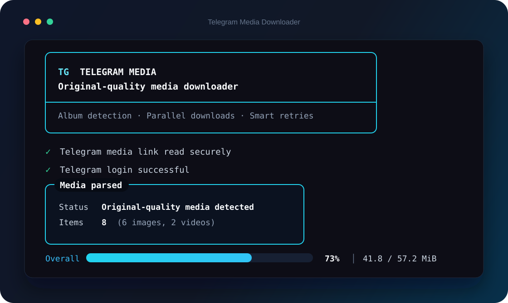

<p align="center">
  <a href="README.md">简体中文</a> · <strong>English</strong>
</p>

<div align="center">
  
  <h1>Telegram Media Downloader</h1>
  <p><strong>Turn one Telegram URL into a complete set of original-quality media files.</strong></p>
  <p>Save albums, videos, and discussion media with built-in parallel downloads, smart retries, and integrity checks.</p>

  <p>
    <a href="https://github.com/swttttt/telegram-media-downloader/actions/workflows/ci.yml"></a>
    
    
    
  </p>
</div>

<br>

<div align="center">
  
</div>

## Why use it?

<table>
  <tr>
    <td width="50%">
      <h3>🖼️ Complete original-quality albums</h3>
      <p>Automatically detects the full album attached to a post and downloads the best image and video files Telegram provides—without screenshots or re-encoding.</p>
    </td>
    <td width="50%">
      <h3>⚡ Fast and reliable</h3>
      <p>Three parallel downloads by default, exponential-backoff retries, flood-wait handling, file-reference refresh, and <code>cryptg</code>-accelerated decryption.</p>
    </td>
  </tr>
  <tr>
    <td width="50%">
      <h3>💬 Discussion media supported</h3>
      <p>Understands channel discussion URLs containing <code>?comment=</code> and resolves the linked discussion and media album automatically.</p>
    </td>
    <td width="50%">
      <h3>🔐 Secure credentials</h3>
      <p>API credentials are stored in Windows Credential Manager. Login sessions, downloads, and temporary files are excluded from Git.</p>
    </td>
  </tr>
</table>

## Get started in three steps

### 1. Clone

```powershell
git clone https://github.com/swttttt/telegram-media-downloader.git
cd telegram-media-downloader
```

### 2. Install dependencies

```powershell
python -m pip install -r requirements.txt
```

### 3. Launch

Double-click `start.bat` and choose **English**, or run:

```powershell
python telegram_media_downloader.py --lang en
```

Paste a Telegram post URL when prompted. Downloads are saved to the `download` folder beside the script by default.

To make English the default interface:

```powershell
setx TMD_LANG en
```

> The first run asks for your own `API_ID` and `API_HASH`. Create them at [my.telegram.org](https://my.telegram.org) → **API development tools**. They are securely saved after the first entry.

## Supported URLs

```text
# Public channel post or album
https://t.me/ExampleChannel/37

# Telegram's single form
https://t.me/ExampleChannel/37?single

# Media in a channel discussion
https://t.me/channel/737?single&comment=7145

# A private channel you have joined
https://t.me/c/1234567890/321
```

Discussion media receives clear, collision-resistant filenames:

```text
channel_737_comment_7145_01.jpg
channel_737_comment_7145_02.mp4
```

## Command-line usage

```powershell
# Download a post directly
python telegram_media_downloader.py URL --lang en

# Choose a destination
python telegram_media_downloader.py URL --output "E:\Telegram" --lang en

# Overwrite existing files
python telegram_media_downloader.py URL --overwrite --lang en

# Customize parallelism and retries
python telegram_media_downloader.py URL --jobs 4 --retries 6 --lang en

# Delete stored API credentials
python telegram_media_downloader.py --forget-credentials --lang en
```

| Option | Purpose | Default |
| --- | --- | --- |
| `url` | Telegram post, album, or discussion URL | Interactive prompt |
| `-o, --output` | Media destination | `./download` |
| `--overwrite` | Replace existing same-name files | Off |
| `-j, --jobs` | Parallel downloads, from 1 to 8 | `3` |
| `--retries` | Retry count after network failures, from 0 to 10 | `5` |
| `--forget-credentials` | Remove API credentials from Windows Credential Manager | — |
| `--lang` | Interface language: `zh` or `en` | `zh` |

## Reliability by design

- Downloads are first written to hidden `.part` files and atomically moved into place only after completion.
- File sizes are strictly checked whenever Telegram provides an expected size.
- Network timeouts, temporary Telegram service failures, and expired file references recover automatically.
- Existing files are skipped by default, so rerunning a URL does not waste bandwidth.
- Telegram flood waits are respected instead of being retried aggressively.
- A local Telegram session is protected from simultaneous use by multiple downloader processes.

## Project structure

```text
telegram-media-downloader/
├─ assets/                       # README branding and interface previews
├─ telegram_media_downloader.py  # Main application
├─ start.bat                     # Bilingual Windows launcher
├─ README.md                     # 简体中文 documentation
├─ README_EN.md                  # English documentation
├─ requirements.txt              # Python dependencies
├─ LICENSE                       # MIT License
└─ download/                     # Local downloads, excluded from Git
```

## FAQ

<details>
<summary><strong>Why are API_ID and API_HASH required?</strong></summary>
<br>
Telegram user clients must connect through an official API application identity. These values are not a Bot Token or your account password, and this project never writes them into source code or a plain-text configuration file.
</details>

<details>
<summary><strong>Why does it say another downloader is already running?</strong></summary>
<br>
The Telegram login session is stored in SQLite and cannot be written by two processes at the same time. Close the old window or wait for it to finish.
</details>

<details>
<summary><strong>Why can’t it download a private channel URL?</strong></summary>
<br>
The Telegram account currently signed in must already be a member of that channel and have permission to view the target message.
</details>

<details>
<summary><strong>Are files compressed?</strong></summary>
<br>
No. The downloader saves the media returned by the Telegram API without transcoding or recompression.
</details>

## Security and responsible use

`telegram_media.session` represents your local login session and must never be shared. It is excluded by `.gitignore`. Only download content you have permission to access and save, and follow Telegram’s terms and applicable law.

## License

[MIT](LICENSE) © 2026 [swttttt](https://github.com/swttttt)
